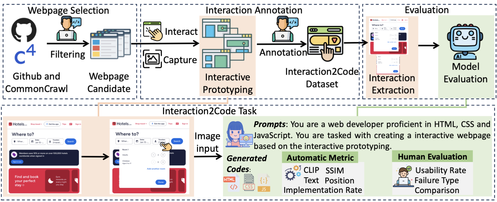
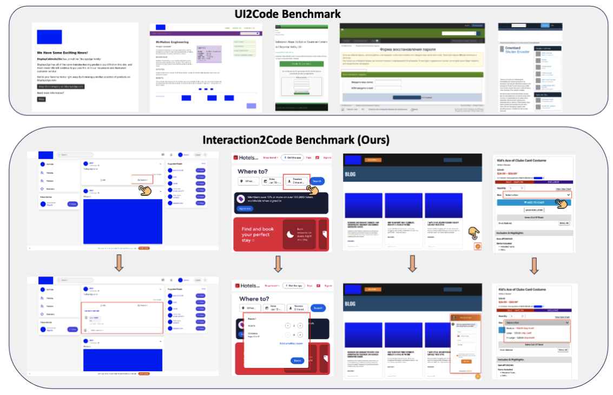
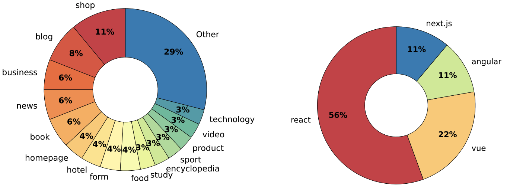

# Interaction2Code: Benchmarking MLLM-based Interactive Webpage Code Generation from Interactive Prototyping

Interaction2Code is a collection of webpage datasets for interactive webpage generation [Paper](https://arxiv.org/abs/2411.03292).

Quick links:  [Project Page](https://webpai.github.io/Interaction2Code/) | [Benchmark Examples](#Benchmark-Examples) | [Dataset Download](#Dataset-Download) | [Hugging-face](https://huggingface.co/datasets/whale99/Interaction2Code) | [Leaderboard](#Leaderboard) | [Code usage](#Code-Usage) | [Demo Video](#Demo-Video) 


## Repository Organization

This repository contains:

1. **Dataset**. The sample of our experiment data is available in `/sample`. We will release the full dataset as soon as the paper is published.
2. **Codes**. The code is available in `/code`, including the interactive webpage generation, metric calculation and annotation.
3. **Human evaluation results** The results of human evaluation are in `/huamn_evalauation`. We will release the full human evaluation results as soon as the paper is published.
4. **Demo video**. In `assets/video.mov`


```
.
├── assets
├── example # example for interactive webpage generation
├── code
│   ├── annotation # annotation tool for benchmark construction
│   ├── metric # metric calculation
│   └── prompting # interactive page generation
├── human_evaluation
│   └── failure # annotation for failure case and pair-wise comparison
│       └── figure
└── sample # sampled dataset

```


## Introduction

Multimodal Large Language Models (MLLMs) have demonstrated remarkable performance on the design-to-code task, i.e., generating UI code from UI mock-ups. However, existing benchmarks only contain static web pages for evaluation and ignore the dynamic interaction, limiting the practicality, usability and user engagement of the generated webpages.

To bridge these gaps, we present the first systematic investigation of MLLMs in generating interactive webpages. Specifically, we formulate the **Interaction-to-Code** task and establish the **Interaction2Code** benchmark, encompassing **127** unique webpages and **374** distinct interactions across **15** webpage types and **31** interaction categories. Through comprehensive experiments utilizing state-of-the-art (SOTA) MLLMs, evaluated via both automatic metrics and human assessments, we identify four critical limitations of MLLM on Interaction-to-Code task: (1) inadequate generation of interaction compared with full page, (2) prone to ten types of failure, (3) poor performance on visually subtle interactions, and (4) insufficient undestanding on interaction when limited to single-modality visual descriptions. To address these limitations, we propose four enhancement strategies: Interactive Element Highlighting, Failureaware Prompting (FAP), Visual Saliency Enhancement, and Visual-Textual Descriptions Combination, all aiming at improving MLLMs’ performance on the Interaction-toCode task.





## Benchmark Examples

Comparison between UI2Code benchmark and our Interaction2Code benchmark. UI2Code benchmark
only contains the static webpage, whereas Interaction2Code contains interactive webpage, which is represented by
interactive prototyping





## Benchmark Statistics


### Quantitative metrics.

| Metric          | Min   | Max     | Average | Std    |
|-----------------|-------|---------|---------|--------|
| Length (tokens) | 82    | 769,466 | 127,604 | 165,046|
| Tag Count       | 2     | 5,739   | 983     | 1,038  |
| DOM Depth       | 2     | 38      | 16      | 6      |
| Unique Tags     | 2     | 52      | 28      | 11     |
| Total size      |       |         |         | 127    |


### Tag and visual categories distribution.


| Tag        | Number    | Tag   | Number | Visual          | Number |
|---------------|-----------|-----------|--------|---------------|--------|
| button        | 235       | summary   | 15     | text          | 162    |
| input         | 52        | form      | 13     | new component | 161    |
| span          | 37        | detail    | 12     | color         | 85     |
| link          | 36        | video     | 11     | position      | 45     |
| select        | 35        | area      | 9      | switch        | 41     |
| textarea      | 35        | output    | 9      | new page      | 37     |
| option        | 31        | datalist  | 8      | new window    | 34     |
| iframe        | 28        | dialog    | 6      | size          | 20     |
| text          | 24        | audio     | 5      | -             | -      |
| progress      | 22        | template  | 3      | -             | -      |
| image         | 21        | table     | 1      | -             | -      |
| label         | 16        | -         | -      | -             | -      |


### Topic and framework distribution




### Dataset Download

We put some samples  in `sample/`:

You can download the full Interaction2Code dataset from this [Google Drive link](https://drive.google.com/file/d/1mxBtlTBEQiEUyr_CnEBAVa3jBSPaDFwL/view?usp=sharing). 
You can download from [hugging-face](https://huggingface.co/datasets/whale99/Interaction2Code)
After downloading, you can get a dataset folder, which contains 1-127 subfolders, corresponding to 127 web pages. Each subfolder contains interactive prototyping images and action.json to describe different interactive information.
And the result subfolder contains the webpages generated by MLLMs.

Action.json:
```json
{
  "link": "https://salinaka-ecommerce.web.app/shop", 
  "topic": "shop",
  "framework": "react",
  "1": {
    "src": "0",
    "dst": "1",
    "tag type": [
      "image",
      "span"
    ],
    "visual type": [
      "new component",
      "text",
      "position"
    ]
  }
}
```

The link, topic and framework are the information about the webpage.
The "1" denotes the first interaction, 
the interactive prototyping images are 0.png and 1.png, where 0.png is the screenshot before the interaction and 1.png is the screenshot after the interaction.
Tag type and visual type describe the interaction type.


## Leaderboard


[comment]: <> (| Model                          | Prompt        | CLIP   | SSIM   | Text   | CLIP   | SSIM   | Text   | Position | IR     |)

[comment]: <> (|---------------------------|---------|--------|--------|--------|--------|--------|--------|----------|--------|)

[comment]: <> (| Qwen2.5-vl-3B-instruct    | Direct  | 0.3220 | 0.1932 | 0.1510 | 0.2100 | 0.1531 | 0.0415 | 0.2090   | 0.3449 |)

[comment]: <> (|                           | CoT     | 0.2031 | 0.1085 | 0.0800 | 0.1219 | 0.0894 | 0.0352 | 0.1212   | 0.1979 |)

[comment]: <> (|                           | Mark    | 0.2752 | 0.1503 | 0.1200 | 0.1706 | 0.1188 | 0.0514 | 0.1706   | 0.2647 |)

[comment]: <> (|                           | Average | 0.2668 | 0.1507 | 0.1170 | 0.1675 | 0.1204 | 0.0427 | 0.1669   | 0.2692 |)

[comment]: <> (| Qwen2.5-vl-7B-instruct    | Direct  | 0.4169 | 0.2886 | 0.2519 | 0.3230 | 0.2177 | 0.0952 | 0.2529   | 0.4786 |)

[comment]: <> (|                           | CoT     | 0.3895 | 0.2529 | 0.2207 | 0.2806 | 0.1981 | 0.0744 | 0.2259   | 0.4305 |)

[comment]: <> (|                           | Mark    | 0.4586 | 0.3282 | 0.2703 | 0.3541 | 0.2468 | 0.1348 | 0.2798   | 0.5267 |)

[comment]: <> (|                           | Average | 0.4217 | 0.2899 | 0.2477 | 0.3192 | 0.2209 | 0.1015 | 0.2529   | 0.4786 |)

[comment]: <> (| Qwen2.5-vl-72B-instruct   | Direct  | 0.6430 | 0.4234 | 0.4197 | 0.4624 | 0.3207 | 0.2450 | 0.3950   | 0.6524 |)

[comment]: <> (|                           | CoT     | 0.6335 | 0.4785 | 0.4585 | 0.5090 | 0.3692 | 0.2376 | 0.4385   | 0.7380 |)

[comment]: <> (|                           | Mark    | 0.6954 | 0.4569 | 0.4586 | 0.4992 | 0.3621 | 0.2995 | 0.4541   | 0.7112 |)

[comment]: <> (|                           | Average | 0.6573 | 0.4529 | 0.4456 | 0.4902 | 0.3507 | 0.2607 | 0.4292   | 0.7005 |)

[comment]: <> (| Gemini-1.5-flash          | Direct  | 0.5967 | 0.4526 | 0.4749 | 0.4737 | 0.3616 | 0.2809 | 0.4320   | 0.6738 |)

[comment]: <> (|                           | CoT     | 0.6166 | 0.4810 | 0.4775 | 0.5093 | 0.3854 | 0.3217 | 0.4511   | 0.7112 |)

[comment]: <> (|                           | Mark    | 0.6321 | 0.4946 | 0.4878 | 0.5194 | 0.3898 | 0.3454 | 0.4612   | 0.7326 |)

[comment]: <> (|                           | Average | 0.6151 | 0.4761 | 0.4801 | 0.5008 | 0.3789 | 0.3160 | 0.4481   | 0.7059 |)

[comment]: <> (| GPT-4o                    | Direct  | 0.7114 | 0.5277 | 0.5147 | 0.5605 | 0.4149 | 0.3590 | 0.4888   | 0.7754 |)

[comment]: <> (|                           | CoT     | 0.6905 | 0.4962 | 0.4761 | 0.5234 | 0.4013 | 0.3663 | 0.4668   | 0.7273 |)

[comment]: <> (|                           | Mark    | 0.7160 | 0.5539 | 0.5112 | 0.5955 | 0.4488 | 0.4474 | 0.5225   | 0.8128 |)

[comment]: <> (|                           | Average | 0.7059 | 0.5259 | 0.5007 | 0.5598 | 0.4217 | 0.3909 | 0.4927   | 0.7718 |)

[comment]: <> (| Claude-3.5-Sonnet         | Direct  | 0.7172 | 0.5318 | 0.6003 | 0.5674 | 0.4209 | 0.3833 | 0.5123   | 0.7914 |)

[comment]: <> (|                           | CoT     | 0.6961 | 0.5110 | 0.5603 | 0.5606 | 0.4005 | 0.3662 | 0.5085   | 0.7727 |)

[comment]: <> (|                           | Mark    | 0.7258 | 0.5299 | 0.5899 | 0.5944 | 0.4282 | 0.4319 | 0.5149   | 0.7968 |)

[comment]: <> (|                           | Average | 0.7130 | 0.5242 | 0.5835 | 0.5742 | 0.4165 | 0.3938 | 0.5119   | 0.7870 |)


**Table:** Interaction Part performance of different MLLMs under different prompts on Interaction-to-Code task.  
- **Bold values** indicate the optimal performance.  

| Model                          | Prompt        | CLIP   | SSIM   | Text   | Position | Implement Rate     |
|---------------------------|---------|--------|--------|--------|----------|--------|
| Qwen2.5-vl-3B-instruct    | Direct  | **0.2100** | **0.1531** | 0.0415 | **0.2090**   | **0.3449** |
|                           | CoT     | 0.1219 | 0.0894 | 0.0352 | 0.1212   | 0.1979 |
|                           | Mark    | 0.1706 | 0.1188 | **0.0514** | 0.1706   | 0.2647 |
|                           | Average | 0.1675 | 0.1204 | 0.0427 | 0.1669   | 0.2692 |
| Qwen2.5-vl-7B-instruct    | Direct  | 0.3230 | 0.2177 | 0.0952 | 0.2529   | 0.4786 |
|                           | CoT     | 0.2806 | 0.1981 | 0.0744 | 0.2259   | 0.4305 |
|                           | Mark    | **0.3541** | **0.2468** | **0.1348** | **0.2798**   | **0.5267** |
|                           | Average | 0.3192 | 0.2209 | 0.1015 | 0.2529   | 0.4786 |
| Qwen2.5-vl-72B-instruct   | Direct  | 0.4624 | 0.3207 | 0.2450 | 0.3950   | 0.6524 |
|                           | CoT     | **0.5090** | **0.3692** | 0.2376 | 0.4385   | **0.7380** |
|                           | Mark    | 0.4992 | 0.3621 | **0.2995** | **0.4541**   | 0.7112 |
|                           | Average | 0.4902 | 0.3507 | 0.2607 | 0.4292   | 0.7005 |
| Gemini-1.5-flash          | Direct  | 0.4737 | 0.3616 | 0.2809 | 0.4320   | 0.6738 |
|                           | CoT     | 0.5093 | 0.3854 | 0.3217 | 0.4511   | 0.7112 |
|                           | Mark    | **0.5194** | **0.3898** | **0.3454** | **0.4612**   | **0.7326** |
|                           | Average | 0.5008 | 0.3789 | 0.3160 | 0.4481   | 0.7059 |
| GPT-4o-20240806                    | Direct  | 0.5605 | 0.4149 | 0.3590 | 0.4888   | 0.7754 |
|                           | CoT     | 0.5234 | 0.4013 | 0.3663 | 0.4668   | 0.7273 |
|                           | Mark    | **0.5955** | **0.4488** | **0.4474** | **0.5225**   | **0.8128** |
|                           | Average | 0.5598 | 0.4217 | 0.3909 | 0.4927   | 0.7718 |
| Claude-3.5-Sonnet-20240620         | Direct  | 0.5674 | 0.4209 | 0.3833 | 0.5123   | 0.7914 |
|                           | CoT     | 0.5606 | 0.4005 | 0.3662 | 0.5085   | 0.7727 |
|                           | Mark    | **0.5944** | **0.4282** | **0.4319** | **0.5149**   | **0.7968** |
|                           | Average | 0.5742 | 0.4165 | 0.3938 | 0.5119   | 0.7870 |

[comment]: <> (- *Underlined values* indicate the second-best performance.  )

[comment]: <> (- The red value is the highest value among the averages.)


## Code Usage

### Code Generation

Add your keys in `/code/prompting/key.json`
```json
{
  "gemini": "your_gemini_key",
  "gpt": "your_openai_key",
  "claude": "your_anthropic_key",
  "qwen": "your_qwen_key"
}
```


In `/code/prompting`, run the file `generate.py` to generate the interactive webpage:

```python
# prompt_method: direct_prompt/cot_prompt/mark_prompt/critic_prompt
generate_page(path="../../sample/", web_number=1, interact_number=1, prompt_method="direct_prompt")
```
After execution, the webpage file "{interact_numer}-{prompt_method}-{model}.html" will be generated in the folder `sample/{web_number}`.

### Running Automatic Evaluation
In `/code/metric`, run the file `calculate_metric.py` to evaluate:

Step1: Automatically interact with the generated webpage

```python
web_name = "1"
interact_name = "1"
model_name = "gemini"
prompt_name = "direct_prompt"
prediction_path = "../../sample/"

interact_by_id(file_name=prediction_path + f"{web_name}/result/{interact_number}-{prompt_name}-{model_name}.html",
               folder_path=prediction_path + f"{web_name}/result/{interact_number}-{prompt_name}-{model_name}/")
```

Step2: Calculate the metrics
```python
full_page_results, interact_results, message = get_all_score(web_name, interaction_number, model_name, prompt_name)
```
results format, flag is true when the interaction is implemented.
```json
    "qwen-vl-72B-cot_prompt":{
      "full page": {
        "clip_similarity": 0.81982421875,
        "text_similarity": 0.45577372341821776,
        "structure_similarity": 0.6626702389332161
      },
      "interact": {
        "clip_similarity": 0.7373046875,
        "text_similarity": 0.00034724158769516573,
        "structure_similarity": 0.6418328233948984,
        "position_similarity": 0.9618190618867396
      },
      "message": {
        "flag": true,
        "dataset/6/result/3-cot_prompt-qwen-vl-72B": "Good"
      }
```


## Failure Type Description

### Failure on Interactive Elements


[comment]: <> ()

(a) **Interactive element missing**: MLLMs do not generate interactive elements. As shown in Figure (a), there is a chat button in the upper right corner of the reference web page. When clicked, a chat window pops up. However, there is no such button in the generated web page, and users cannot perform any operation.

(b) **No interaction**: There is no interaction in the generated webpage. As shown in Figure (b), clicking button M in the original webpage will switch to the information of size "M". However, clicking "M" button in the generated, there is no change of the size information.
It should be noted here that sometimes the lack of interaction does not result in the unavailability of functions. For example, suppose a web page contains a menu bar that can display detailed information after clicking. If MLLM does not achieve the click effect, but has displayed the detailed menu information, it does not affect the functionality of the web page.

(c) **Wrong interactive element**: MLLMs implement the interactive function on the wrong element. As shown in Figure (c), in the original webpage, after clicking "I'm donating on behalf of a company or organisation", two input boxes will appear. However, in the generated webpage, the input box will only appear after clicking "I' like to add 0.00 to my donation to cover any fees."

(d) **Wrong type of interactive element**: The types of interactive elements generated by MLLM are wrong. As shown in Figure (d), the element for adjusting the price in the original web page is of input type, while the element for adjusting the price in the generated web page is of progress type.

(e) **Wrong position of interactive element**: The interactive elements generated by MLLM are positioned incorrectly. As shown in Figure (e), the button in the original webpage is in the upper right corner of the image, while the generated button is below the image.

### Failure on Interactive Effects


(f) **Wrong position after interaction**: The interactive effects generated by MLLM are in the wrong position. As shown in Figure (f), after clicking the dialogue button, the pop-up window is displayed in the lower left corner of the reference webpage, but appears in the middle of the generated webpage.

(g) **Wrong type of interaction effects**: As shown in Figure (g), in the reference webpage, the element that appears after clicking select is of option type, but in the generated web page, the element that appears is of text type.

(h) **Effect on wrong element**: MLLMs achieve the effect of interaction on the wrong elements. As shown in Figure (h), in the reference webpage, after clicking the "dark" button, the background color of the web page turns black. However, in the generated web page, after clicking the "dark" button, the block turns black and the background does not change.

(i) **Partial Implementation**: MLLMs only implement a part of the interactive functionality. As shown in Figure (i), in the reference webpage, after clicking the select button, the button will become selected, and will return to its original state when clicked again. However, in the generated web page, the button can only be selected but not unselected.

(j) **Wrong function**: MLLM implements the wrong function. As shown in Figure (j), in the original webpage, clicking the button will cause a date selection box to appear, but in the generated webpage, clicking the button will generate a date display box.


## Demo Video

In this demo video, we use gpt-4o under mark prompting to generate the interactive webpage in `example/`, 0.png represents the screenshot of the original state of the webpage, 
and `1.png`, `2.png`, `3.png` and `4.png` represent the screenshots of the webpage after interactions 1, 2, 3 and 4 respectively.
In `*_mark.png`, that the interactive area and effect are marked. `generated.html` is the webpage generated by gpt-4o.

Here we try to generate four interactions shown as below:


The demo video is as following:

[comment]: <> (```HTML)

[comment]: <> (<video src="./assets/video.mp4" controls="controls" width="500" height="300"></video>)

https://github.com/user-attachments/assets/891e374b-e2d3-48f0-901d-53f90e5d8892

You can also download our demo video in `assets/video.mov`.


## Acknowledgement

Our webpage is filtered from [C4](https://huggingface.co/datasets/legacy-datasets/c4) and [Github](https://github.com/).

If you find our work helpful, please consider citing our paper:

```
@article{xiao2024interaction2code,
  title={Interaction2Code: How Far Are We From Automatic Interactive Webpage Generation?},
  author={Xiao, Jingyu and Wan, Yuxuan and Huo, Yintong and Xu, Zhiyao and Lyu, Michael R},
  journal={arXiv preprint arXiv:2411.03292},
  year={2024}
}
```


