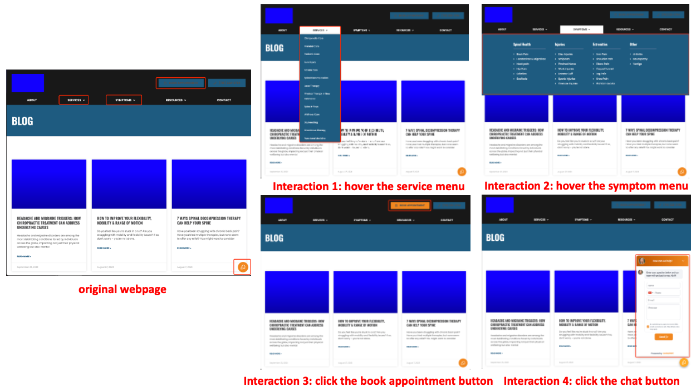

# Interaction2Code: How Far Are We From Automatic Interactive Webpage Generation?

Interaction2Code is a collection of webpage datasets for interactive webpage generation [[Paper]](https://arxiv.org/abs/2411.03292).

This repository contains:

1. **Dataset**. The sample of our experiment data is available in `/sample`.
2. **Codes**. The code is available in `/code`, including the interactive webpage generation and metric calculation.
3. **Human evaluation results** The results of human evaluation are in `/huamn_evalauation`.


## Repository Organization

```
.
├── assets
├── code
│   ├── metric # metric calculation
│   └── prompting # interactive page generation
├── human_evaluation
│   └── failure # annotation for failure case
│       └── figure
└── sample # sampled dataset

```


## Benchmark Statistics

| Metric | Min | Max | Average | Std |
| --- | --- | --- | --- | --- |
| Length (tokens) | 2457 | 726,317 | 141,084 | 160,438 |
| Tag Count | 34 | 12,694 | 1,291 | 1,574 |
| DOM Depth | 6 | 37 | 18 | 6 |
| Unique Tags | 8 | 58 | 31 | 9 |
| Total size | - | - | - | 97 |


| Element | Frequency | Element | Frequency | Types | Frequency |
|---------|-----------|----------|-----------|--------------------|-----------|
| button | 145 | summary | 16 | new component | 94 |
| input | 80 | output | 16 | text | 93 |
| link | 47 | image | 14 | color | 61 |
| iframe | 47 | video | 12 | new window | 25 |
| textarea | 43 | dialog | 11 | position | 21 |
| option | 43 | audio | 7 | size | 16 |
| select | 45 | template | 6 | switch | 15 |
| form | 26 | text | 4 | - | - |
| label | 25 | area | 2 | - | - |
| detail | 24 | span | 2 | - | - |
| progress | 19 | table | 2 | - | - |
| datalist | 16 | - | - | - | - |

Dataset format in `sample/`:
```
The folder name is the number of the webpage.
x.png: the interaction "x" screenshot.
x-1.png: the webpage screenshot before interaction "x".
x-2.png: the webpage screenshot after interaction "x".
x-1-mark.png: the webpage screenshot before interaction "x" with interactive element marked.
x-2-mark.png: the webpage screenshot after interaction "x" with interaction effects area marked.
placeholder.jpg: the placeholder image for the generated webpage.
type: url, topic and interaction type.
```


## Code Usage

### Code Generation

Add your keys in `/code/prompting/key.json`
```json
{
  "gemini": "your_gemini_key",
  "gpt": "your_openai_key",
  "claude": "your_anthropic_key"
}
```


In `/code/prompting`, run the file `gemini.py`, `gpt.py` and `claude.py` to generate the interactive webpage:

```python
# prompt_method: direct_prompt/cot_prompt/mark_prompt
generate_page(path="../../sample/", web_number=1, interact_number=1, prompt_method="direct_prompt")
```
After execution, the webpage file "{interact_numer}-{prompt_method}-{model}.html" will be generated in the folder `sample/{web_number}`.

### Running Automatic Evaluation
In `/code/metric`, run the file `calculate_metric.py` to evaluate:

Step1: Automatically interact with the generated webpage

```python
web_name = 1
interact_name = 1
model_name = "gemini"
prompt_name = "direct_prompt"
prediction_path = "../../sample/"
interact_by_id(file_name=prediction_path+f"{web_name}/{interact_name}-{prompt_name}-{model_name}.html", 
               folder_path=prediction_path+f"{web_name}/{interact_name}-{prompt_name}-{model_name}/")

```

Step2: Calculate the metrics
```python
full_page_results, interact_results, message = get_all_score_new(web_name, interact_name, model_name, prompt_name)
```


## Failure Type Description

### Failure on Interactive Elements


[comment]: <> ()

(a) **Interactive element missing**: MLLMs do not generate interactive elements. As shown in Figure (a), there is a chat button in the upper right corner of the reference web page. When clicked, a chat window pops up. However, there is no such button in the generated web page, and users cannot perform any operation.

(b) **No interaction**: There is no interaction in the generated webpage. As shown in Figure (b), clicking button M in the original webpage will switch to the information of size "M". However, clicking "M" button in the generated, there is no change of the size information.
It should be noted here that sometimes the lack of interaction does not result in the unavailability of functions. For example, suppose a web page contains a menu bar that can display detailed information after clicking. If MLLM does not achieve the click effect, but has displayed the detailed menu information, it does not affect the functionality of the web page.

(c) **Wrong interactive element**: MLLMs implement the interactive function on the wrong element. As shown in Figure (c), in the original webpage, after clicking "I'm donating on behalf of a company or organisation", two input boxes will appear. However, in the generated webpage, the input box will only appear after clicking "I' like to add 0.00 to my donation to cover any fees."

(d) **Wrong type of interactive element**: The types of interactive elements generated by MLLM are wrong. As shown in Figure (d), the element for adjusting the price in the original web page is of input type, while the element for adjusting the price in the generated web page is of progress type.

(e) **Wrong position of interactive element**: The interactive elements generated by MLLM are positioned incorrectly. As shown in Figure (e), the button in the original webpage is in the upper right corner of the image, while the generated button is below the image.

### Failure on Interactive Effects


(f) **Wrong position after interaction**: The interactive effects generated by MLLM are in the wrong position. As shown in Figure (f), after clicking the dialogue button, the pop-up window is displayed in the lower left corner of the reference webpage, but appears in the middle of the generated webpage.

(g) **Wrong type of interaction effects**: As shown in Figure (g), in the reference webpage, the element that appears after clicking select is of option type, but in the generated web page, the element that appears is of text type.

(h) **Effect on wrong element**: MLLMs achieve the effect of interaction on the wrong elements. As shown in Figure (h), in the reference webpage, after clicking the "dark" button, the background color of the web page turns black. However, in the generated web page, after clicking the "dark" button, the block turns black and the background does not change.

(i) **Partial Implementation**: MLLMs only implement a part of the interactive functionality. As shown in Figure (i), in the reference webpage, after clicking the select button, the button will become selected, and will return to its original state when clicked again. However, in the generated web page, the button can only be selected but not unselected.

(j) **Wrong function**: MLLM implements the wrong function. As shown in Figure (j), in the original webpage, clicking the button will cause a date selection box to appear, but in the generated webpage, clicking the button will generate a date display box.


## Demo Video

In this demo video, we use gpt-4o under mark prompting to generate the interactive webpage in `example/`:



The demo video is as following:

[comment]: <> (```HTML)

[comment]: <> (<video src="./assets/video.mp4" controls="controls" width="500" height="300"></video>)

https://github.com/user-attachments/assets/891e374b-e2d3-48f0-901d-53f90e5d8892


## Acknowledgement

Our webpage is filtered from [C4](https://huggingface.co/datasets/c4), the interactive webpage screenshots are annotated by human.

If you find our work helpful, please consider citing our paper:

```

@article{xiao2024interaction2code,
  title={Interaction2Code: How Far Are We From Automatic Interactive Webpage Generation?},
  author={Xiao, Jingyu and Wan, Yuxuan and Huo, Yintong and Xu, Zhiyao and Lyu, Michael R},
  journal={arXiv preprint arXiv:2411.03292},
  year={2024}
}

```
